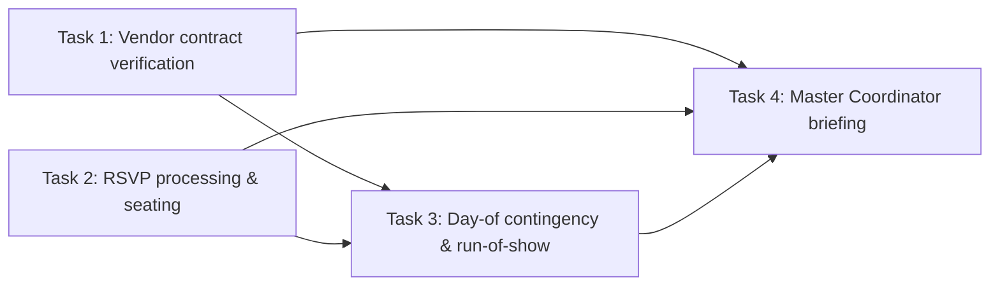
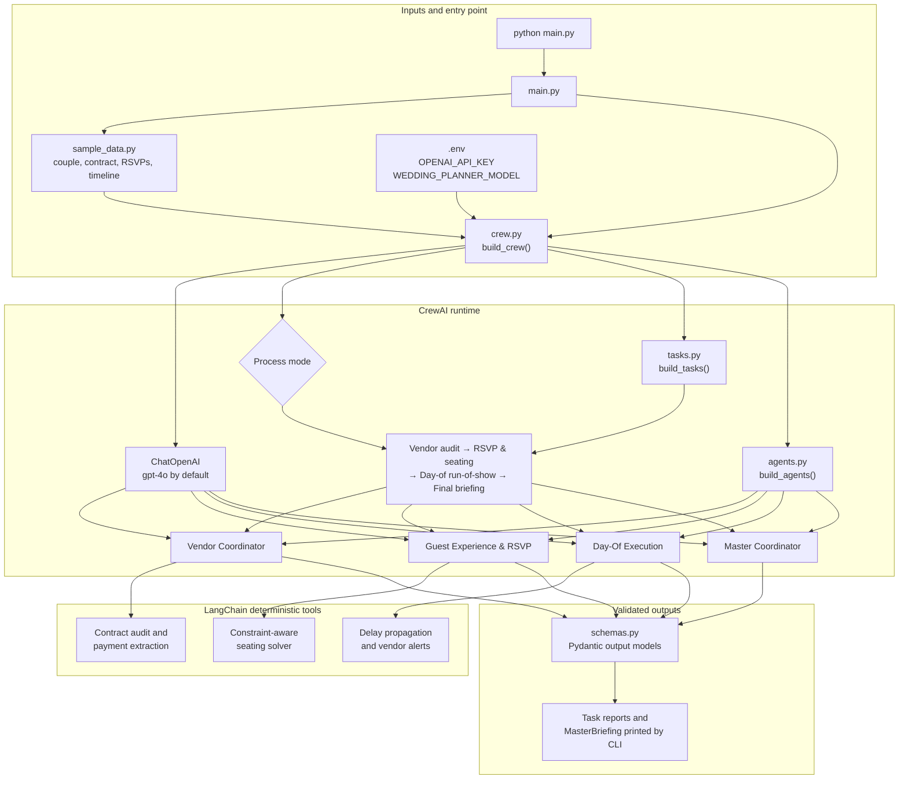

# Wedding Planner

An autonomous multi-agent wedding planning platform built with **CrewAI** and **LangChain tools**.
A Master Coordinator orchestrates three specialist agents that audit vendor contracts, process
RSVPs into a conflict-free seating plan, and re-plan the wedding day when something goes wrong.

## Agents

| Agent | Role | Tools |
|---|---|---|
| Vendor Coordinator | Lead Vendor Negotiator & Contract Auditor | `audit_contract_clause`, `extract_payment_milestones` |
| Guest Experience & RSVP | Guest Logistics & Seating Strategist | `solve_seating_arrangement` |
| Day-Of Execution | Real-Time Timeline Controller | `recalculate_timeline` |
| Master Coordinator | Orchestrates the team and writes the final briefing | none (delegates in hierarchical mode) |

## Workflow



Each task returns a validated Pydantic model (`VendorAuditReport`, `GuestLogisticsReport`,
`RunOfShow`, `MasterBriefing`).

## Architecture

The CLI loads sample wedding data and environment configuration, then `crew.py` assembles the
model, agents, tasks, and orchestration process. Specialist agents call deterministic LangChain
tools; their task results are validated against Pydantic schemas before the Master Coordinator
produces the final briefing.



In **sequential** mode the specialists run in task order and the Master Coordinator synthesizes
their reports. In **hierarchical** mode, CrewAI uses the Master Coordinator as manager to delegate
work to the specialists. The contract, seating, and timeline tools remain deterministic in either
mode; the LLM interprets language and produces the structured reports.

## Tools

The tools use deterministic logic for anything that must be exact (time math, capacity, constraints);
the LLM handles language understanding.

- **`audit_contract_clause(contract_text, venue_rules)`** – compares load-in time, amplified-music
  end time, curfew and decibel limits; returns conflicts with severity and recommendations.
- **`extract_payment_milestones(contract_text, contract_total_usd=0)`** – builds the payment
  schedule, checks it sums to the contract total, and lists cancellation/overtime clauses.
- **`solve_seating_arrangement(guest_data_json, table_capacity)`** – keeps parties (couples,
  plus-ones, caregivers) together, enforces "do not seat near" both ways, groups by relationship
  tags, places mobility needs at accessible tables, and attaches allergy alerts per table.
- **`recalculate_timeline(current_timeline_json, delay_minutes, delayed_event_name)`** – cascades a
  delay to dependent events, never moves fixed landmarks or the hard curfew, and shortens
  compressible events to absorb overruns; drafts vendor alerts.

## Project structure

```
main.py         # CLI entry point and result printing
agents.py       # Specialist and coordinator agent definitions
tasks.py        # Task prompts, context, and output model wiring
crew.py         # Crew assembly and LLM setup
tools.py        # LangChain tool implementations
schemas.py      # Pydantic output models
sample_data.py  # Sample couple, contract, RSVPs, and timeline
__init__.py     # Root package marker and module description
```

The Wedding Planner modules now live directly in the project root. The older `models.py` and
`prompts.py` prototype files remain, but the modular CrewAI application does not use them.

## Setup

Requires Python 3.12+ and [uv](https://docs.astral.sh/uv/).

```powershell
uv sync
```

Create a `.env` file in the project root:

```
OPENAI_API_KEY=sk-...
# Optional, defaults to gpt-4o
WEDDING_PLANNER_MODEL=gpt-4o
```

## How to run

Run from the project root (`wedding-planner/`):

```powershell
# Full multi-agent run, sequential process (default)
uv run python main.py

# Hierarchical process: the Master Coordinator acts as manager and delegates tasks
uv run python main.py --process hierarchical

# Hide verbose agent traces
uv run python main.py --quiet

# Tools only, no LLM calls and no API key needed
uv run python main.py --dry-run
```

If `OPENAI_API_KEY` is not set, the program falls back to `--dry-run` automatically.

With an activated virtual environment you can drop `uv run`:

```powershell
.\.venv\Scripts\Activate.ps1
python main.py
```

## Output

A full run prints each agent's structured result, then the final `MasterBriefing`
(readiness rating, owned actions with deadlines, open risks, and a message for the couple),
followed by token usage.

With the sample data, the dry run shows:

- **Contract audit:** load-in 60 min before venue access (high), music 30 min past the 22:30
  cutoff (critical), 95 dB vs. an 85 dB limit (high).
- **Payments:** $6,500 fully scheduled across deposit, second payment and final balance.
- **Timeline:** the 40-minute dinner delay shifts toasts, first dance and cake cutting; open
  dancing is shortened by 40 minutes so the 22:30 sparkler send-off and 23:30 curfew hold.

## Using your own data

Edit `sample_data.py`:

- `CONTRACT_TEXT`, `VENUE_RULES`, `VENDOR_SHORTLIST` – vendor inputs.
- `BASE_GUEST_LIST` and `RSVP_MESSAGES` – guest list (name, party, tags, ...) and raw RSVP text.
- `TIMELINE` – events with `start` (`HH:MM`), `duration_minutes`, `vendor`, `fixed`,
  `depends_on`, `compressible_minutes`, plus `hard_curfew`.
- `DELAYED_EVENT`, `DELAY_MINUTES`, `INCIDENT_REPORT` – the day-of incident.
- `TABLE_CAPACITY` – seats per table.
